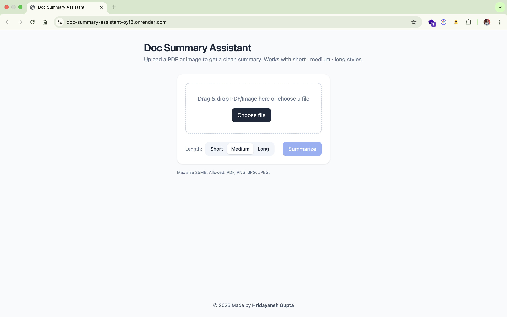
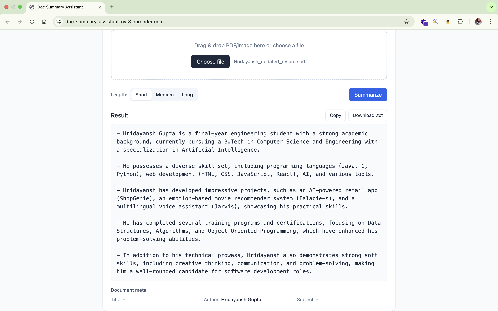

# 📄 Doc Summary Assistant

A simple yet powerful document summarization tool built with **FastAPI + Cohere/OpenAI backend** and a clean HTML/JS frontend.  
It allows you to upload **PDFs or images** → extracts text (OCR for images) → generates concise summaries.

---
## 🖼️ Screenshots




---

## 🚀 Features
- 📑 **PDF Summarization** – Upload any PDF, get concise summaries.
- 🖼 **Image OCR + Summarization** – Extracts text from images and summarizes.
- ⚡ **FastAPI Backend** – Clean, modular Python backend.
- 🎨 **Frontend UI** – Simple HTML/JS interface with file upload and summary view.
- 🔑 **.env support** – Securely manage API keys.
- 🌍 **Deploy-ready** – Works on Render, Netlify, or any cloud hosting.

---

## 🛠️ Tech Stack
- **Backend:** FastAPI, Uvicorn, Pydantic  
- **AI API:** Cohere / OpenAI  
- **PDF Processing:** PyPDF  
- **OCR (Images):** Pillow + pytesseract  
- **Frontend:** HTML, CSS, Vanilla JS  

---

## ⚙️ Setup & Installation

### 1. Clone repo
```bash
git clone https://github.com/<your-username>/doc-summary-assistant.git
cd doc-summary-assistant
```

### 2. Create virtual environment
```bash
python -m venv .venv
source .venv/bin/activate   # Mac/Linux
.venv\Scripts\activate      # Windows
```
### 3. Install dependencies
```bash
cd backend
pip install -r requirements.txt
```

### 4. Configure environment
```bash
Create .env file in root:
COHERE_API_KEY=your_api_key_here
```

### 5. Run locally
```bash
uvicorn main:app --reload --port 8000
Visit 👉 http://localhost:8000
```

## 👨‍💻 Author

Built with ❤️ by Hridayansh Gupta
